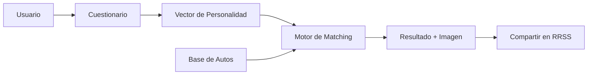
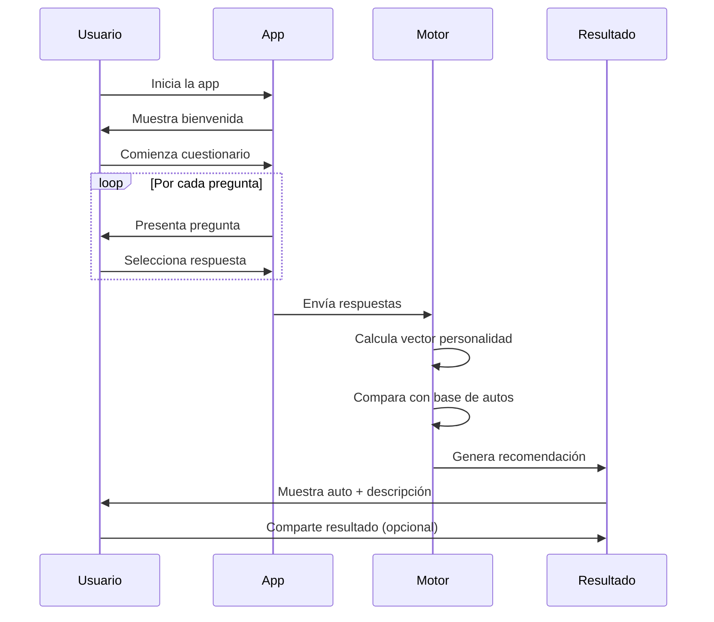

# 🚗 Auto Personality App

> **Una aplicación divertida que encuentra tu auto ideal basándose en tu personalidad**

[](https://www.python.org/)
[](https://streamlit.io/)
[](LICENSE)

## 📋 Tabla de Contenidos

1. [Descripción del Proyecto](#descripción-del-proyecto)
2. [Arquitectura del Sistema](#arquitectura-del-sistema)
3. [Estructura del Proyecto](#estructura-del-proyecto)
4. [Instalación y Configuración](#instalación-y-configuración)
5. [Características Principales](#características-principales)
6. [Flujo de Usuario](#flujo-de-usuario)
7. [Modelos de Autos](#modelos-de-autos)
8. [Algoritmo de Recomendación](#algoritmo-de-recomendación)
9. [Personalización y Extensión](#personalización-y-extensión)
10. [Despliegue](#despliegue)
11. [Roadmap](#roadmap)
12. [Contribuciones](#contribuciones)

## 📝 Descripción del Proyecto

Auto Personality App es una aplicación web interactiva que recomienda el auto perfecto para ti basándose en tus respuestas a preguntas divertidas y curiosas sobre tu estilo de vida y preferencias.

### 🎯 Objetivos

- **Entretenimiento**: Crear una experiencia divertida y compartible
- **Educativo**: Ayudar a los usuarios a descubrir diferentes tipos de vehículos
- **Social**: Generar resultados que los usuarios quieran compartir en redes sociales

## 🏗️ Arquitectura del Sistema

### Capas del Sistema

| Capa | Componente | Descripción |
|------|------------|-------------|
| **Frontend** | Streamlit UI | Interfaz web interactiva con cuestionario y resultados visuales |
| **Lógica de Negocio** | Motor de Matching | Algoritmo de distancia Euclídea para encontrar coincidencias |
| **Datos** | Perfiles de Autos | Base de datos en memoria con características vectorizadas |
| **Salida** | Generador de Resultados | Crea descripciones personalizadas y contenido compartible |

### Flujo de Datos



## 📁 Estructura del Proyecto

```
auto-personality-app/
│
├── app.py                    # Aplicación principal de Streamlit
├── requirements.txt          # Dependencias del proyecto
├── README.md                # Documentación principal
├── LICENSE                  # Licencia MIT
│
├── data/
│   ├── cars.json           # Base de datos de autos
│   └── questions.json      # Banco de preguntas
│
├── assets/
│   ├── images/             # Imágenes de los autos
│   │   ├── tesla_model3.jpg
│   │   ├── toyota_prius.jpg
│   │   └── ...
│   └── icons/              # Iconos y emojis
│
├── src/
│   ├── __init__.py
│   ├── matcher.py          # Lógica del motor de recomendación
│   ├── personality.py      # Procesamiento de respuestas
│   └── utils.py           # Funciones auxiliares
│
├── tests/
│   ├── test_matcher.py
│   └── test_personality.py
│
└── docs/
    ├── CONTRIBUTING.md     # Guía para contribuidores
    └── API.md             # Documentación técnica
```

## 💻 Instalación y Configuración

### Requisitos Previos

- Python 3.8 o superior
- pip (gestor de paquetes de Python)
- Git

### Instalación Local

```bash
# Clonar el repositorio
git clone https://github.com/gear-go/auto-personality-app.git
cd auto-personality-app

# Crear entorno virtual (recomendado)
python -m venv venv
source venv/bin/activate  # En Windows: venv\Scripts\activate

# Instalar dependencias
pip install -r requirements.txt

# Ejecutar la aplicación
streamlit run app.py
```

## ✨ Características Principales

### 1. **Cuestionario Interactivo**
- 5-7 preguntas divertidas y no convencionales
- Opciones de respuesta visual con emojis
- Progreso visible del cuestionario

### 2. **Sistema de Personalidad**
Cinco dimensiones de evaluación:
- 🌱 **Sostenibilidad**: Consciencia ambiental
- 🏎️ **Prestaciones**: Búsqueda de potencia y velocidad
- 💎 **Lujo y Confort**: Preferencia por comodidades premium
- 🛠️ **Versatilidad**: Necesidad de funcionalidad múltiple
- 📱 **Tech-savvy**: Afinidad con la tecnología

### 3. **Visualización de Resultados**
- Imagen del auto recomendado
- Descripción personalizada
- Match percentage
- Top 3 alternativas
- Botones para compartir en redes sociales

## 🎮 Flujo de Usuario



## 🚙 Modelos de Autos

### Base de Datos Inicial

| Modelo | Tipo | Características Clave |
|--------|------|----------------------|
| Tesla Model 3 | Sedán Eléctrico | Tech, Sostenible, Premium |
| Toyota Prius | Híbrido | Eficiente, Práctico, Eco |
| Ford F-150 | Pickup | Versátil, Potente, Trabajo |
| Mazda MX-5 | Deportivo | Fun, Ágil, Estilo |
| Honda CR-V | SUV | Familiar, Confiable, Espacioso |
| Mini Cooper | Compacto | Urbano, Personalidad, Eficiente |
| BMW Serie 3 | Sedán Premium | Lujo, Deportivo, Status |
| Jeep Wrangler | Todo Terreno | Aventurero, Robusto, Libertad |

### Formato de Datos (cars.json)

```json
{
  "cars": [
    {
      "id": "tesla_model3",
      "brand": "Tesla",
      "model": "Model 3",
      "type": "Sedán Eléctrico",
      "year": 2024,
      "vector": [5, 4, 4, 3, 5],
      "description": "El futuro sobre ruedas. Perfecto para tech lovers conscientes del ambiente.",
      "emoji": "⚡",
      "image": "tesla_model3.jpg",
      "features": ["Autopilot", "0 emisiones", "Actualizaciones OTA"],
      "price_range": "$$$"
    }
  ]
}
```

## 🧮 Algoritmo de Recomendación

### Implementación Actual: Distancia Euclídea

```python
def calculate_match(user_vector, car_vector):
    """
    Calcula la similitud entre vectores de usuario y auto
    """
    distance = np.sqrt(np.sum((user_vector - car_vector) ** 2))
    similarity = 1 / (1 + distance)
    return similarity * 100  # Porcentaje de match
```

### Futuras Mejoras
- Weighted matching (ponderación por importancia)
- Machine Learning (Random Forest, KNN)
- Embeddings de texto para descripciones
- Filtros por precio/tipo

## 🎨 Personalización y Extensión

### 1. **Agregar Nuevas Preguntas**
```python
new_question = {
    "id": "q6",
    "text": "¿Cuál sería tu road trip ideal?",
    "options": [
        {"text": "Costa con vistas al mar 🌊", "weights": [3, 2, 4, 2, 3]},
        {"text": "Montañas y aventura 🏔️", "weights": [2, 4, 2, 5, 2]},
        {"text": "Ciudades y cultura 🏙️", "weights": [4, 3, 3, 2, 4]}
    ]
}
```

### 2. **Temas Visuales**
- Modo claro/oscuro
- Paletas de colores personalizables
- Animaciones y transiciones

### 3. **Localización**
- Soporte multi-idioma
- Catálogos regionales de autos
- Monedas locales

## 🚀 Despliegue

### Opción 1: Streamlit Community Cloud (Recomendado)
1. Push el código a GitHub
2. Conecta tu repo en [share.streamlit.io](https://share.streamlit.io)
3. Deploy automático con URL pública

### Opción 2: Heroku
```bash
# Crear Procfile
echo "web: streamlit run app.py --server.port $PORT" > Procfile

# Deploy
heroku create tu-app-name
git push heroku main
```

### Opción 3: Docker
```dockerfile
FROM python:3.9-slim
WORKDIR /app
COPY requirements.txt .
RUN pip install -r requirements.txt
COPY . .
EXPOSE 8501
CMD ["streamlit", "run", "app.py"]
```

## 📈 Roadmap

### Fase 1: MVP (Actual) ✅
- [x] Cuestionario básico funcional
- [x] 8-10 modelos de autos
- [x] Algoritmo simple de matching
- [x] Interfaz Streamlit

### Fase 2: Mejoras UX 🚧
- [ ] Animaciones y transiciones
- [ ] Modo oscuro
- [ ] Resultados más detallados
- [ ] Comparador de autos

### Fase 3: Features Sociales 📅
- [ ] Compartir en Instagram Stories
- [ ] Leaderboard de autos populares
- [ ] Modo "encuentra tu auto con amigos"
- [ ] Integración con APIs de reviews

### Fase 4: Inteligencia Avanzada 🔮
- [ ] ML para recomendaciones
- [ ] Análisis de tendencias
- [ ] Predicción de preferencias
- [ ] Chat con IA sobre autos

## 🤝 Contribuciones

¡Las contribuciones son bienvenidas! Por favor:

1. Fork el proyecto
2. Crea tu feature branch (`git checkout -b feature/AmazingFeature`)
3. Commit tus cambios (`git commit -m 'Add: nueva característica'`)
4. Push a la branch (`git push origin feature/AmazingFeature`)
5. Abre un Pull Request

### Guías de Contribución
- Sigue el estilo de código PEP 8
- Añade tests para nuevas funcionalidades
- Actualiza la documentación
- Mantén los commits descriptivos

## 📄 Licencia

Este proyecto está bajo la Licencia MIT. Ver `LICENSE` para más detalles.

## 🙏 Agradecimientos

- Streamlit por el framework increíble
- La comunidad de Python
- Todos los contribuidores del proyecto

---

**Hecho con ❤️ para los amantes de los autos y la tecnología**

*¿Encontraste tu auto ideal? ¡Comparte tus resultados y etiquétanos!* 🚗✨